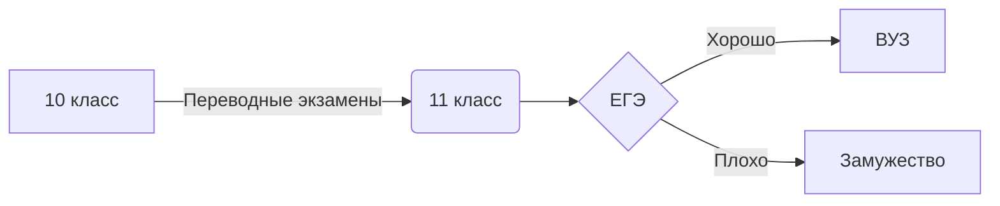
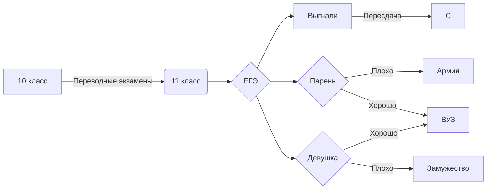

# 132
Работы Трофимовой Анастасии 132 группа
Все пять работ есть и pdf, программа морзянки отдельно, а все остальное в папке
 1. Морзе
 2. Таблица СС
 3. Перевод СС
 4. Таблица иксель (таблица, перевод, ряд Фиббоначи)
 5. Pdf (дилинжер)
 6. Иксель с морзе
 7. код Хэмминга 
 8. Юпитер мои коды
 9. Таблица лог оппераций 
 10. Скрины с нейросети 
 11. Скрин с дз
 12. работа с логическими операциями в python
 13. automouse
 14. формула логического закона 4 на LaTex
 15. Презентация с картинками
 16. Программа по решению задачь на кодирование 
 17. Викторина 
 18. Пример функции 

 $$(A\vee B) \vee C= A \vee (B \vee C)$$

$$\upsilon_2=\sqrt{2G\frac{M}{R_{0}}}$$

$$E_{св}=(Zm_p+Nm_n+m_я)c^2$$

$$\overline{E^2_1}=\sqrt{\frac{Fa^{x-1}}{(x-1)\cdot x}}+\alpha^{\frac{1}{3}}_1+\beta^{\frac{2}{3}}_2$$

